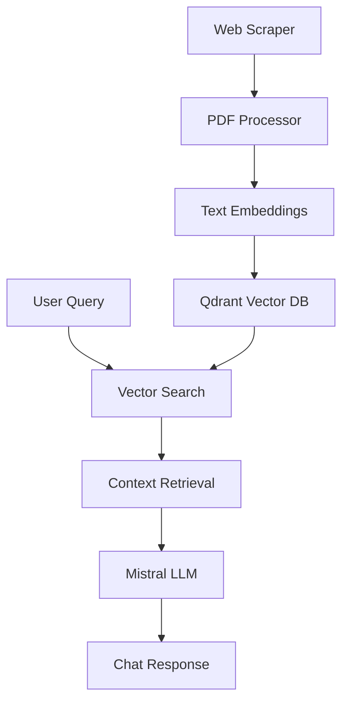

# CIB Financial Assistant Bot 🏦

An intelligent chatbot for analyzing Commercial International Bank (CIB) Egypt's financial statements using RAG (Retrieval-Augmented Generation) with vector search and Mistral AI.

## 🚀 Features

- **PDF Scraping & Processing**: Automatically scrapes CIB financial statements from their website
- **Intelligent Text Extraction**: Advanced PDF parsing with OCR support for complex financial documents
- **Vector Search**: Semantic search using Qdrant vector database with sentence transformers
- **AI-Powered Chat**: Chainlit-based chat interface with streaming responses from Mistral AI
- **Bilingual Support**: Handles both English and Arabic financial documents
- **Docker Support**: Containerized deployment with Docker Compose

## 📁 Project Structure

```
cib_bot/
├── bot.ipynb                 # Main development notebook
├── cibbot.py                # Chainlit chat application
├── chainlit.md              # Chainlit configuration
├── requirements.txt         # Python dependencies
├── docker-compose.yml       # Docker services configuration
├── Dockerfile              # Container configuration
├── scraper/                # Web scraping modules
│   └── statement_scraper.py
├── processing/             # PDF processing modules
│   ├── parser.py          # PDF text extraction
│   └── labeller.py        # Metadata extraction
├── embeddings/            # Text embedding generation
│   └── embed.py
├── vectorDB/              # Vector database operations
│   └── qdrant_scripts.py
├── generation/            # LLM integration
│   └── llm.py
└── statements/           # Downloaded PDF files (gitignored)
```

## 🛠️ Installation

### Prerequisites

- Python 3.8+
- Docker & Docker Compose
- Ollama with Mistral model
- Chrome/Brave browser (for scraping)

### Setup

1. **Clone the repository**
   ```bash
   git clone <your-repo-url>
   cd cib_bot
   ```

2. **Create virtual environment**
   ```bash
   python -m venv uvbotenv
   source uvbotenv/bin/activate  # On Windows: uvbotenv\Scripts\activate
   ```

3. **Install dependencies**
   ```bash
   pip install -r requirements.txt
   ```

4. **Start required services**
   ```bash
   # Start Qdrant vector database
   docker-compose up -d qdrant
   
   # Install and start Ollama with Mistral
   ollama pull mistral
   ollama serve
   ```

## 📊 Usage

### 1. Data Processing (Jupyter Notebook)

Open `bot.ipynb` and run the cells to:

1. **Scrape financial statements** from CIB website
2. **Process PDF documents** and extract structured text
3. **Generate embeddings** and populate vector database
4. **Test search functionality** with sample queries

### 2. Chat Interface

Start the Chainlit application:

```bash
chainlit run cibbot.py
```

The bot will be available at `http://localhost:8000`

### 3. Docker Deployment

For production deployment:

```bash
docker-compose up -d
```

## 🔧 Configuration

### Environment Variables

Create a `.env` file for custom configuration:

```env
QDRANT_HOST=localhost
QDRANT_PORT=6333
OLLAMA_URL=http://localhost:11434
COLLECTION_NAME=cib_financial_statements
```

### Model Configuration

The project uses:
- **Embedding Model**: `all-MiniLM-L6-v2` (SentenceTransformers)
- **LLM**: Mistral via Ollama
- **Vector Database**: Qdrant

## 🏗️ Architecture



## 📚 Key Components

### PDF Processing Pipeline
- **Scraper**: Selenium-based web scraping with metadata extraction
- **Parser**: Multi-modal PDF processing (text + OCR) with page classification
- **Embeddings**: Semantic text chunking and vector generation

### RAG System
- **Retrieval**: Semantic search using cosine similarity
- **Augmentation**: Context-aware prompt building with text cleaning
- **Generation**: Streaming responses from Mistral with financial context

### Chat Interface
- **Chainlit**: Modern web-based chat UI
- **Streaming**: Real-time token-by-token response generation
- **Bilingual**: English/Arabic support with proper Unicode handling

## 🧪 Development

### Running Tests

```bash
# Test individual components in notebook
jupyter notebook bot.ipynb

# Test chat interface
chainlit run cibbot.py --port 8001
```

### Adding New Features

1. **New PDF Sources**: Extend `statement_scraper.py`
2. **Enhanced Processing**: Modify `parser.py` for new document types
3. **Custom Models**: Update `embed.py` and `llm.py` for different models

## 📝 API Reference

### Key Functions

- `process_pdf_document()`: Extract structured text from PDF
- `get_embeddings()`: Generate semantic embeddings
- `search_qdrant()`: Perform vector similarity search
- `build_contextual_prompt()`: Create RAG prompts with context

## 🤝 Contributing

1. Fork the repository
2. Create a feature branch (`git checkout -b feature/amazing-feature`)
3. Commit your changes (`git commit -m 'Add amazing feature'`)
4. Push to the branch (`git push origin feature/amazing-feature`)
5. Open a Pull Request

## 📄 License

This project is licensed under the MIT License - see the [LICENSE](LICENSE) file for details.

## ⚠️ Disclaimer

This tool is for educational and research purposes. Financial data should be verified against official CIB publications. The accuracy of AI-generated responses is not guaranteed.

## 🆘 Support

For issues and questions:
- Open an issue on GitHub
- Check the notebook examples in `bot.ipynb`
- Review the Docker logs for debugging

---

Made with ❤️ for financial data analysis and AI education.
