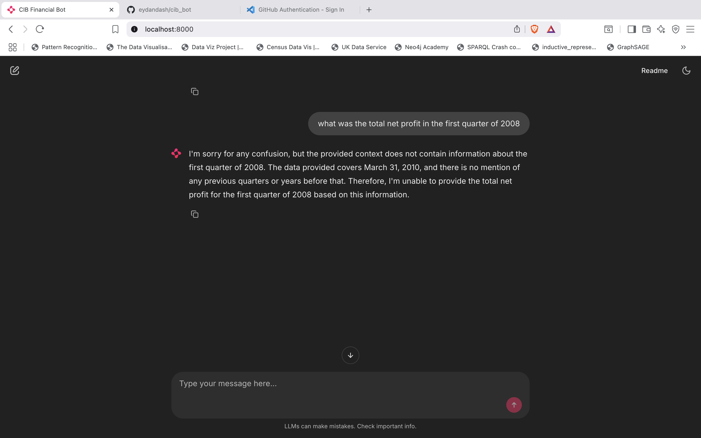
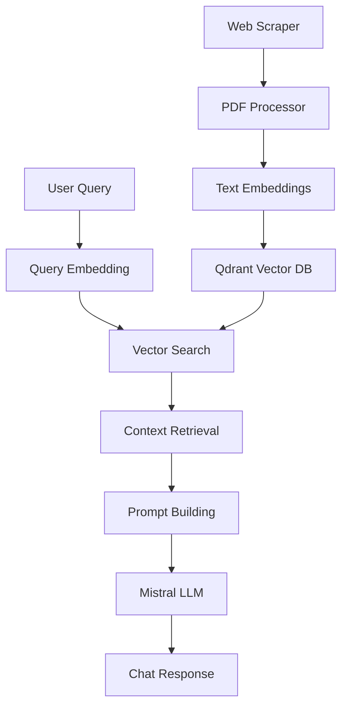

# CIB Financial Assistant Bot 🏦

An intelligent chatbot for analyzing Commercial International Bank (CIB) Egypt's financial statements using RAG (Retrieval-Augmented Generation) with vector search and Mistral AI.

> **Note**: This project was developed and tested on a limited resource macOS laptop for testing purposes. Make sure to update browser paths in the scraping configuration to match your system setup.

> **Prerequisites**: The program expects the host machine to be running Mistral on Ollama locally before starting the application.

## 🚀 Features

- **PDF Scraping & Processing**: Automatically scrapes CIB financial statements from their website
- **Intelligent Text Extraction**: Advanced PDF parsing with OCR support for complex financial documents
- **Vector Search**: Semantic search using Qdrant vector database with sentence transformers
- **AI-Powered Chat**: Chainlit-based chat interface with streaming responses from Mistral AI
- **Bilingual Support**: Handles English financial documents (Arabic document processing planned with specialized embedding models)
- **Docker Support**: Containerized deployment with Docker Compose

## 📁 Project Structure

```
cib_bot/
├── bot.ipynb                 # Main development notebook
├── cibbot.py                # Chainlit chat application
├── chainlit.md              # Chainlit configuration
├── requirements.txt         # Python dependencies
├── docker-compose.yml       # Docker services configuration
├── Dockerfile              # Container configuration
├── scraper/                # Web scraping modules
│   └── statement_scraper.py
├── processing/             # PDF processing modules
│   ├── parser.py          # PDF text extraction
│   └── labeller.py        # Metadata extraction
├── embeddings/            # Text embedding generation
│   └── embed.py
├── vectorDB/              # Vector database operations
│   └── qdrant_scripts.py
├── generation/            # LLM integration
│   └── llm.py
└── statements/           # Downloaded PDF files (gitignored)
```

## 🛠️ Installation

### Prerequisites

- Python 3.8+
- Docker & Docker Compose
- Ollama with Mistral model
- Chrome/Brave browser (for scraping)

> **Important**: Before running the scraper, update the browser path in `bot.ipynb` (cell 1) to match your system's browser location. The current path is configured for macOS Brave Browser.

### Setup

1. **Clone the repository**
   ```bash
   git clone https://github.com/eydandash/cib_bot.git OR DOWNLOAD THIS DIRECTORY
   cd cib_bot
   ```

2. **Create virtual environment**
   ```bash
   python -m venv uvbotenv
   source uvbotenv/bin/activate  # On Windows: uvbotenv\Scripts\activate
   ```

3. **Install dependencies**
   ```bash
   pip install -r requirements.txt
   ```
   > All required libraries are listed in `requirements.txt` and optimized for limited resource environments. When using Docker, dependencies are automatically installed during the first container build.

4. **Start required services**
   ```bash
   # Start Qdrant vector database
   docker-compose up -d qdrant
   
   # Install and start Ollama with Mistral
   ollama pull mistral
   ollama serve
   ```

## 📊 Usage

### 1. Data Processing (Jupyter Notebook)

Open `bot.ipynb` and run the cells to:

1. **Scrape financial statements** from CIB website
2. **Process PDF documents** and extract structured text
3. **Generate embeddings** and populate vector database
4. **Test search functionality** with sample queries

### 2. Chat Interface

Start the Chainlit application:

```bash
chainlit run cibbot.py
```

The bot will be available at `http://localhost:8000`


*The Chainlit-based chat interface showing real-time streaming responses with financial context*

### 3. Docker Deployment

For production deployment:

```bash
docker-compose up -d --build
```

## 🔧 Configuration

### Environment Variables

Currently maintained inside code, but I will create a `.env` file for custom configuration and loabenv:

```env
QDRANT_HOST=localhost
QDRANT_PORT=6333
OLLAMA_URL=http://localhost:11434
COLLECTION_NAME=cib_financial_statements
```

### Model Configuration

The project uses:
- **Embedding Model**: `all-MiniLM-L6-v2` (SentenceTransformers)
- **LLM**: Mistral via Ollama
- **Vector Database**: Qdrant

## 🏗️ Architecture



## 📚 Key Components

### PDF Processing Pipeline
- **Scraper**: Selenium-based web scraping with metadata extraction. This was particularly tricky because I had to mimic the browsing as a client more such that instead of opening the link I download from the link and assign a clean name to help with the emedding, in an annotation style of working.
- **Parser**: Multi-modal PDF processing (text + OCR) with page classification. Currently, easyOCR is not working and crashes my laptop, also tries Docling but even heavier. I use only fitz (mupdf) to identify what pages are what type, then i extract accorsingly. Progress detailed in the notebook.
- **Embeddings**: Semantic text chunking and vector generation. Other chunking techniques need to be used, specifically chunking by string length, or semantically using langraph. It is mainly due to the time constraint that I couldn't experiment as much.

### RAG System
- **Retrieval**: Semantic search using cosine similarity
- **Augmentation**: Context-aware prompt building with text cleaning
- **Generation**: Streaming responses from Mistral with financial context

### Chat Interface
- **Chainlit**: Modern web-based chat UI with streaming responses
- **Real-time Processing**: Token-by-token response generation for better user experience

## 🧪 Development

### Running Tests

```bash
# Test individual components in notebook
jupyter notebook bot.ipynb

# Test chat interface
chainlit run cibbot.py
```

### Adding New Features
 In the future, I would like to make this project more accuarate through:
1. **New PDF Sources**: Extending the work with additional parsing, chunking and embeddings model. Also adding arabic encoding. 
2. **Enhanced Processing**: Whether before or after vector search, I would like to test additional steps including OCR and semantic chunking using transformers. Unfortunately CPU-based performence was very limited with Docling and OCR.
3. **Custom Models**: Update `embed.py` and `llm.py` for different models, I am particularly keen on the chaingraph and openAPI integrations.
4. **Cloud Deployment**: Currently learning GCP and Vertix AI, hoping I would be able to develop or host my inference loads on cloud.


